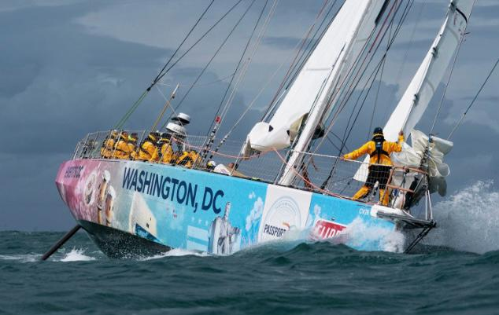

**Hi, I'm Robert,** I'm an engineering leader living in the Boston area. Building secure programs that enable businesses to move fast and grow fascinates me. I've focused my career in financial services with startups and scaleups. I have experience scaling teams from zero to multiple squads and establishing right sized program management.

---

**When I'm away from the office,** I enjoy taking on big challenges. In 2018, after seven years building rowing experience, I fulfilled a dream of mine. I led a four man team successfully across the Pacific Ocean (Monterey, CA to Oahu, HI) in the Great Pacific Race. We labored and raced for 49 days 23 hours 15 minutes finishing and winning the event outright. I'm extremely thankful for everyone in my life investing their time to make my dream of crossing the Pacific Ocean by human power happen.

Many people know me as a rower but not many know that I started rowing because I wanted to row across an ocean. You could say I've never had a hard time with dreaming big. 

---

**In Summer 2026,** I'll be crewing onboard Team Washington DC in the Clipper Round the World yacht race. I will be taking part in Leg 8, crossing the North Atlantic, over 6000 miles of racing in a one-make series of 70 foot Clipper boats. I'm eagerly looking forward to the challenge and once again venturing off into blue water. 

